  

**AI Infra SRE | Robotics | CILIKUBE Core Developer**

  
  
  
  

  

---

### 👋 About Me  

SRE / platform engineering for **AI Infra & robotics** — clusters, observability, and automated delivery by day; building [CILIKUBE](https://cilikube.cillian.website) and other open source by night.

- 🌱 **Focus**: Robotics, AI Infra, cloud-native, Go / Vue / React, DevOps
- 💼 **Collab**: Open to software & open-source work → [github.com/ciliverse](https://github.com/ciliverse)
- 🌐 **Site**: [www.cillian.website](https://www.cillian.website)
- ☸️ **CILIKUBE**: [cilikube.cillian.website](https://cilikube.cillian.website)
- 📫 **Email**: [cilliantech@gmail.com](mailto:cilliantech@gmail.com)
- 🎯 **Interests**: Programming, music, painting, sleeping

---

### 🚀 My Projects 

| Project Name | Description | Tech Stack |
| ------------ | ----------- | ---------- |
| [**CILIKUBE**](https://github.com/ciliverse/cilikube) | Kubernetes multi-cluster resource management platform · [Website](https://cilikube.cillian.website) | **Vue** / **React** / **Go** |
| [**CILITERM**](https://github.com/ciliverse/ciliterm) | Cross-platform terminal emulator with system monitoring, file browsing, network traffic visualization, and a 3D globe | Electron / Vue3 |

---

### 👥 Open Source Contributions  

| Project Name | Description | Tech Stack |
| ------------ | ----------- | ---------- |
| [**CiliVerse**](https://github.com/ciliverse) | Maintaining the CILIKUBE / CILITERM cloud-native and developer tooling ecosystem | Vue / Go / Electron |
| [**V3-Admin-Vite**](https://github.com/un-pany/v3-admin-vite) | Contributions and practice around the Vue 3 admin template (Vite + Element Plus) | Vue3 / Vite / Element Plus |

---

### 🎓 Certifications  
- [AWS/CNCF Badges](https://www.credly.com/users/cilliantech/badges)
- [Zabbix Certified User 6.0](https://www.zabbix.com/certificate/?firstname=Xuerui&lastname=Zhang&certificate=CU-2306-014)
- AWS Certified DevOps Engineer – Professional
- Kubernetes: CKA, CKAD, KCNA, Security Specialist
- Node.js Application Developer

  
  
  
  
  
  
  

---

### 🛠️ Tech Stack  

  
  
  
  
  
  
  

---

### 📈 Statistics  

  

---

💡 **The meaning of life can be hard to see at times — but pouring yourself into something you love with like-minded people is already one of the most meaningful ways to live.**

