  

**AI Infra SRE | 机器人行业 | CILIKUBE 核心开发者**

  
  
  
  

  

---

### 👋 关于我  

面向 **AI Infra / 机器人** 场景的运维与平台工程，日常围绕集群、可观测与自动化交付；业余维护 [CILIKUBE](https://cilikube.cillian.website) 等开源项目。

- 🌱 **近期关注**：机器人、AI Infra、云原生、Go / Vue / React、DevOps 最佳实践
- 💼 **合作**：欢迎软件开发与开源协作 → [github.com/ciliverse](https://github.com/ciliverse)
- 🌐 **主页**：[www.cillian.website](https://www.cillian.website)
- ☸️ **CILIKUBE**：[cilikube.cillian.website](https://cilikube.cillian.website)
- 📫 **邮箱**：[cilliantech@gmail.com](mailto:cilliantech@gmail.com)
- 🎯 **兴趣**：编程、音乐、绘画、睡觉

---

### 🚀 我的开源项目 

| 项目名称 | 描述 | 技术栈 |
| -------- | ---- | ------ |
| [**CILIKUBE**](https://github.com/ciliverse/cilikube) | Kubernetes 多集群资源管理平台，适合学习与企业场景 · [官网](https://cilikube.cillian.website) | **Vue** / **React** / **Go** |
| [**CILITERM**](https://github.com/ciliverse/ciliterm) | 基于 Electron 与 Vue3 的跨平台终端模拟器，含系统监控、文件浏览、网络流量可视化与 3D 地球动画 | Electron / Vue3 |

---

### 👥 开源贡献  

| 项目名称 | 描述 | 技术栈 |
| -------- | ---- | ------ |
| [**CiliVerse**](https://github.com/ciliverse) | 维护 CILIKUBE / CILITERM 等云原生与开发者工具生态 | Vue / Go / Electron |
| [**V3-Admin-Vite**](https://github.com/un-pany/v3-admin-vite) | Vue 3 管理后台模板（Vite + Element Plus）贡献与实践 | Vue3 / Vite / Element Plus |

---

### 🎓 证书  
- [AWS/CNCF 认证](https://www.credly.com/users/cilliantech/badges)
- [Zabbix 认证用户 6.0](https://www.zabbix.com/certificate/?firstname=Xuerui&lastname=Zhang&certificate=CU-2306-014)
- AWS 认证 DevOps 工程师 – 专业级
- Kubernetes: CKA、CKAD、KCNA、安全专家
- Node.js 应用开发者

  
  
  
  
  
  
  

---

### 🛠️ 技术栈  

  
  
  
  
  
  
  

---

### 📈 统计信息  

  

---

💡 **生活的意义，也许一时难以看清，但能和一群志同道合的人，全情投入地做一些喜欢和热爱的事，这本身就是最有意义的活法！**

